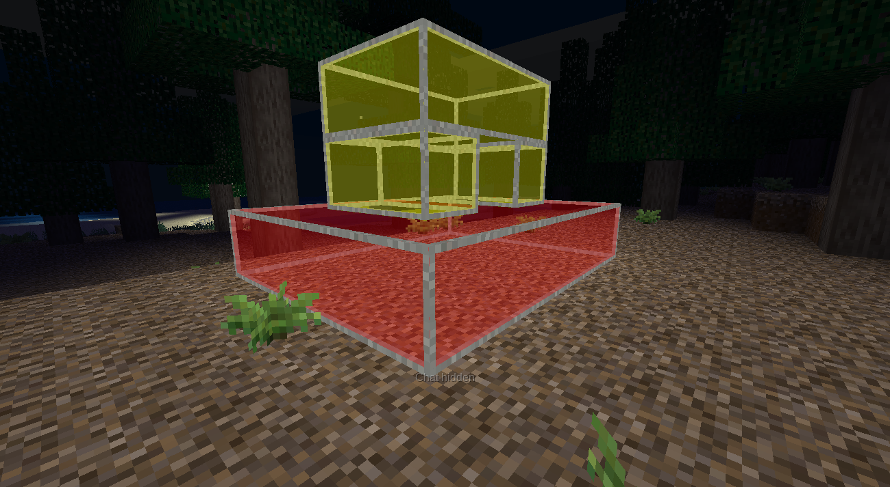

# New glass

This mod provides a glowing version of steel framed obsidian glass node from
a ``framedglass`` mod. It supports many colors.

Probably it will support the colored versions of a node like ``dark_glass`` from
``scifi_nodes`` mod. Maybe not.

Screenshots
===========

Installation
============

First of all, install ``unifieddyes`` and ``framedglass`` mods,
these are required.

Move this mod directory at your minetest mod directory.
For example, in Linux it's ``/home/username/.minetest/mods/new_glass``.

You should be able to see ``init.lua`` file in this new_glass directory,
to be clear.
