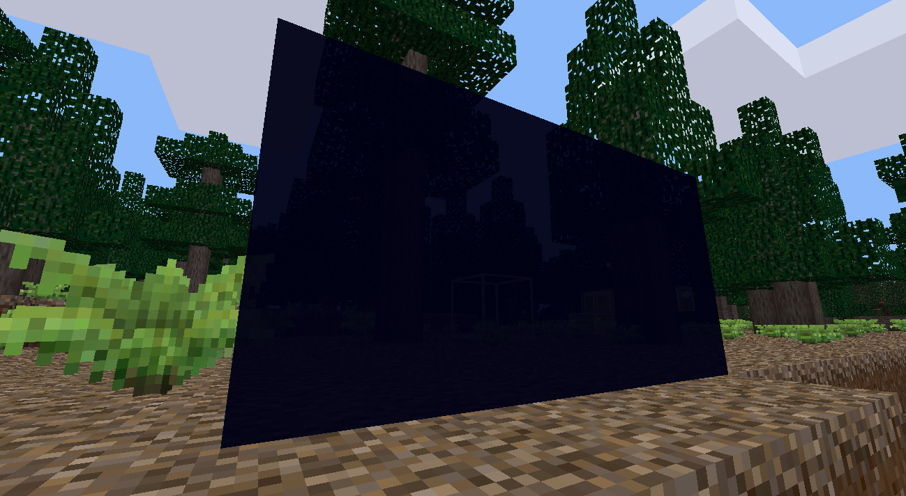

# New glass

This mod provides a glowing version of steel framed obsidian glass node from
a ``framedglass`` mod. It supports many colors.

It also adds nodes, similar to a colored version of ``dark_glass`` from
``scifi_nodes`` mod.

Screenshots
===========

Installation
============

First of all, install ``unifieddyes`` and ``framedglass`` mods,
these are required for this mod to work.

These are installed from archives and metod is the same as
this mod's installation.

Move this mod directory at your minetest mod directory.
For example, in Linux it's ``/home/username/.minetest/mods/new_glass``.

You should be able to see ``init.lua`` file in this new_glass directory,
to be clear.

License
=======

Copyright (C) 2020 Victor Gridnevsky (6r1d) and contributors. Based on [framed glass](https://github.com/minetest-mods/framedglass) mod by Maciej Kasatkin (RealBadAngel).

All code and textures are licensed under the GNU LGPLv2+.
